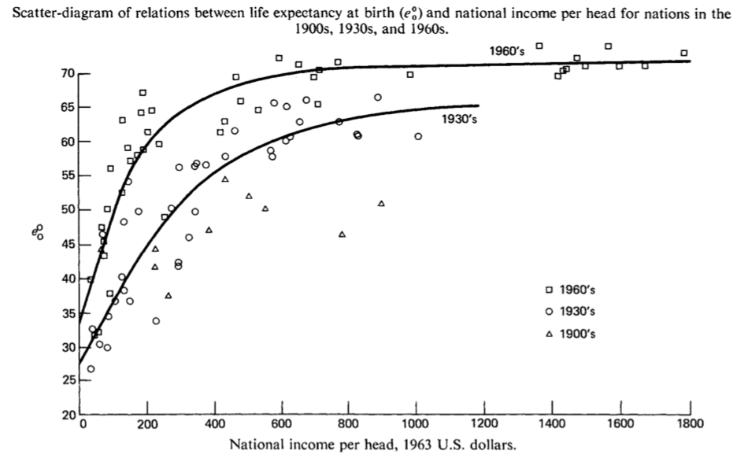

```{r setup, message=FALSE, warning=FALSE, include=FALSE}
library(dplyr)
library(ggplot2)
library(stringr)
library(knitr)
library(kableExtra)
opts_chunk$set(fig.pos = 'p') # Places figures on their own pages
opts_chunk$set(out.width = '100%', dpi=300)
opts_chunk$set(echo=FALSE, message=FALSE, warning=FALSE, cache=FALSE)

load("../data/generated/sample.rda")
load("../output/results.rda")
```

\pagebreak

# Introduction
  
The scientific community widely agrees that reproduction, defined as reproducing findings using the same sample and method, and replication,  defined as retesting findings using a new sample while applying the same method, of empirical results are a central building block of  sound empirical evidence. Yet, although data and code repositories are on the rise, the additional materials only rarely lead to studies being directly reproducible. While several reasons for this observation have been discussed by prior literature, most commentators agree that the lack of established reproducible workflows makes reproductions and replications  inherently costly to do (@GGR2018). 

On the GitHub repository of the TRR 266 "Accounting for Transparency", we host and maintain a repository (https://github.com/trer) that implements a bare-bones reproducible workflow. This paper stub is included in the repo and can be reproduced in its entirely by running the code included in the repository.


# The Preston Curve as a Case Study

To demonstrate the workflow, I replicate a well-known association in global health and development economics: the positive association of national income per capita as assessed by country-level real Gross Domestic Product (GDP) per capita with country-average life expectancy at birth. This association has become known as the "Preston Curve" (@P1975), as reproduced in Figure \ref{fig:preston_curve}. 

```{r fig_preston_curve, out.height="15cm", fig.align = "center", fig.cap="\\label{fig:preston_curve}Preston Curve (Preston (1975): 235)"}

```

While it is unclear whether the association is indicative for a causal link of national income on life expectancy, it is often referred to in public debates as one of the main arguments why economic growth is socially desirable. The analysis presented here is only meant to  demonstrate the workflow of the repository and not to contribute to the underlying 
question of causality. \textcolor{blue}{However, the investigation will be extended by including the independent variable the health expenditures per capita (Idea from} @dalgaard2014optimal\textcolor{blue}{).}

The data for the analysis has been collected from the Open Data repository of the World Bank (https://data.worldbank.org). \textcolor{blue}{For the graphical representation of the world in Figure \ref{fig:worldmap}, the package of}  @KW2013  \textcolor{blue}{was used.}  The sample is limited to country-year observations that have non-missing values for all variables and I use the natural logarithm of GDP per capita as my measure for national income per capita to account for the underlying growth process that shapes national income. The descriptive statistics of the data are presented in Table \ref{tab:descriptives}.

Table \ref{tab:corr} reports the correlations between dependent and independent variables. \textcolor{blue}{It can be seen that the strongest correlation exists between the natural logarithms of GDP and health expenditures. Therefore, both variables should be not included in the same regression model due to multicollinearity.} As expected, \textcolor{blue}{the correlation table} features a strong positive correlation between national income and life expectancy.  Figure \ref{fig:scatter} visualizes this association.


To verify that this association is robust to including controls and general cross-sectional as well as time variance, I estimate the respective coefficient for GDP per capita in a multiple  regression framework. Using a level-log multiple regression setup, Table \ref{tab:reg} yields a set of model estimates. As you can see, the association between national income and life expectancy is significant at conventional levels across all specifications. The magnitude of the association, however, is significantly reduced once one controls for unobserved cross-sectional variation by including country fixed effects. \textcolor{blue}{The regression three in Table \ref{tab:reg} provides evidence that including the natural logarithm of health expenditure per capita increases the} $R^2$.

\textcolor{blue}{To test whether these associations are robust, I undertake an robustness check by only regressing the associations on a subsample of countries above the middle income (see Regression Table \ref{tab:reg_high}). It can be seen that the} $R^2$ \textcolor{blue}{decreases, however, the direction and the significance are very similar.} 

# Conclusion

The Preston curve is alive and well. While being simplistic, the presented analysis contains all main building blocks of a typical empirical study based on observational data: data collection, sample specification, variable construction, exploratory as well as confirmatory analysis and result presentation. Have fun using this template for your own projects and consider contributing to its development, e.g., by providing code for Software packages besides R.

```{r World_Map, echo = FALSE, fig.align="center", fig.cap="\\label{fig:worldmap}Life Expectancy in the World"}
fig_world
```


```{r Scatter, echo = FALSE, fig.align="center", fig.cap="\\label{fig:scatter}National Income and Life Expectancy"}
fig_scatter
```


```{r tab_descriptives_sample, results="asis"}
desc_rnames <- paste0("\\textit{", smp_def$label[7:10], "}")
t <- tab_desc_stat
rownames(t$df) <- desc_rnames
names(t$df)[c(5,7)] <- c("25 \\%", "75 \\%")
kable(
  t$df, digits = c(0, 3, 3, 3, 3, 3, 3, 3), format = "latex",
  caption = "\\label{tab:descriptives}Descriptive Statistics",
  format.args = list(decimal.mark = ".", big.mark = ",", 
                     scientific=FALSE),
  booktabs = TRUE, escape = FALSE, linesep = ""
) -> kab_latex

lat_tab <- unlist(strsplit(kab_latex, "\n"))
lat_tab[6] <- "\\\\[-1.8ex]\\hline \\hline \\\\[-1.8ex]"
lat_tab[8] <- "\\hline\\\\[-1.8ex]"
lat_tab[length(lat_tab) - 2] <- "\\\\[-1.8ex]\\hline \\hline \\\\[-1.8ex]"

latex_tab <- c(
  "\\begin{table}[!htbp]",  
  lat_tab[3],
  "\\begin{adjustbox}{width=\\textwidth}",
  "\\begin{threeparttable}",
  lat_tab[5:(length(lat_tab) - 1)],
  "\\begin{tablenotes}[flushleft]",
  "\\setlength{\\labelsep}{0pt}",
  "\\footnotetext",
  sprintf(
    "\\item Note: The data is obtained from the World Bank. The sample covers %d countries and the period %d to %d. \\textit{National Income per captia} values are in constant 2010 thousand U.S. dollars. \\textit{Health expenditures per capita} are in current US. dollars", length(unique(smp$country)),
    min(as.numeric(as.character(smp$year))), 
    max(as.numeric(as.character(smp$year)))
  ),
  "\\end{tablenotes}",
  "\\end{threeparttable}",
  "\\end{adjustbox}",
  "\\end{table}"
)
cat(paste(latex_tab, collapse = "\n"))  
```


``` {r CorrTable, results="asis"}
tab <- tab_corr
lat_tab <- unlist(strsplit(tab$kable_ret, "\n"))
lat_tab[7:10] <- str_replace(
  lat_tab[7:10], fixed(smp_def$var_name[9:12]), smp_def$label[9:12]
)
lat_tab[4] <- "\\\\[-1.8ex]\\hline \\hline \\\\[-1.8ex]"
lat_tab[6] <- "\\hline\\\\[-1.8ex]"
lat_tab[11] <- "\\\\[-1.8ex]\\hline \\hline \\\\[-1.8ex]"
lat_tab[13] <- "\\begin{tablenotes}[flushleft] \\setlength{\\labelsep}{0pt} \\footnotetext"

latex_tab <- c(
  "\\begin{table}[!htbp]",  
  "\\centering",
  "\\caption{\\label{tab:corr}Correlations}",
  lat_tab,
  "\\end{table}"
)
cat(paste(latex_tab, collapse = "\n"))
```

``` {r RegTable, results="asis"}
tab <- tab_regression$table
tab[12] <- paste(
  "\\\\[-1.8ex] & \\multicolumn{5}{c}{", smp_def$label[10], "} \\\\"
)
esc_var_names <- str_replace_all(smp_def$var_name, fixed ("_"), "\\_")
reg_names <- tibble(
  var_name = esc_var_names[c(10, 8)],
  label = smp_def$label[c(10, 8)]
)
for (i in c(15, 18)) {
  pos <- (i-12)/3
  tab[i] <- str_replace(
    tab[i], fixed(reg_names$var_name[pos]), reg_names$label[pos]
  )
}
latex_tab <- c(
  "\\begin{table}[!htbp]",  
  "\\caption{\\label{tab:reg}Main Regressions}",
  "\\centering",
  "\\begin{tabular}{lccccc}",
  tab[8:33],
  "\\end{tabular}",
  "\\end{table}"
)
cat(paste(latex_tab, collapse = "\n"))
```

``` {r RegTable High, results="asis"}
tab <- tab_regression_high$table
tab[12] <- paste(
  "\\\\[-1.8ex] & \\multicolumn{5}{c}{", smp_def$label[10], "} \\\\"
)
esc_var_names <- str_replace_all(smp_def$var_name, fixed ("_"), "\\_")
reg_names <- tibble(
  var_name = esc_var_names[c(10, 8)],
  label = smp_def$label[c(10, 8)]
)
for (i in c(15, 18)) {
  pos <- (i-12)/3
  tab[i] <- str_replace(
    tab[i], fixed(reg_names$var_name[pos]), reg_names$label[pos]
  )
}
latex_tab <- c(
  "\\begin{table}[!htbp]",  
  "\\caption{\\label{tab:reg_high}Robustness Regressions with Subsample}",
  "\\centering",
  "\\begin{tabular}{lccccc}",
  tab[8:33],
  "\\end{tabular}",
  "\\end{table}"
)
cat(paste(latex_tab, collapse = "\n"))
```

\pagebreak

\setcounter{table}{0}
\renewcommand{\thetable}{\arabic{table}}

# References {-}
\setlength{\parindent}{-0.2in}
\setlength{\leftskip}{0.2in}
\setlength{\parskip}{8pt}
\noindent
